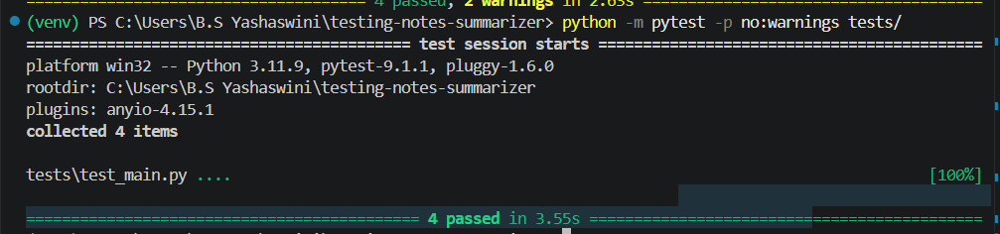

# Quality Assurance & Testing Strategy

## Overview
The testing strategy for the QA Insight Summarizer emphasizes API resilience, schema validation, and strict LLM guardrails. We utilize `pytest` alongside FastAPI's `TestClient` to ensure the decoupling of our AI logic remains robust under various edge cases.

## Test Matrix

| Test ID | Description | Expected Outcome | Actual Outcome | Status |
|---------|-------------|------------------|----------------|--------|
| `TC-001` | API Health Check | `GET /api/health` returns `200 OK` | Returned `{"status": "ok"}` | ✅ PASS |
| `TC-002` | Empty Input Validation | `POST /api/analyze` with empty string returns HTTP `400` | Returned `400 Bad Request` | ✅ PASS |
| `TC-003` | False-Positive Guardrail | Non-testing text (e.g., a recipe) sets `is_testing_notes = False` | AI rejected payload with reason | ✅ PASS |
| `TC-004` | Valid Schema Extraction | Valid testing notes return strictly typed JSON matching `SummaryOutput` | Output matched Pydantic schema | ✅ PASS |
| `TC-005` | UI Export Integrity | Clicking Export correctly formats JSON into Markdown/PDF | Downloaded valid `.md` file | ✅ PASS |
| `TC-006` | Client-Side Storage | Session storage clears upon browser closure | Storage cleared successfully | ✅ PASS |

## Negative & Edge Case Handling

Instead of relying purely on UI validation, we engineered backend guardrails to prevent API abuse and token waste:
1. **The Recipe Test (Intent Validation):** If a user pastes irrelevant text (e.g., a conversation or cooking recipe), the Groq LLM evaluates the *intent* of the prompt before parsing. It flags the input as invalid, preventing the hallucination of fake software bugs.
2. **Length Guardrails:** Inputs under 20 characters or over 15,000 characters are intercepted by the API layer and rejected before ever hitting the LLM, protecting rate limits.
3. **Graceful Fallbacks:** If the AI model occasionally truncates a JSON response (a common issue with free-tier LLMs), the `pipeline.py` catches the `JSONDecodeError` and returns a safe API failure rather than a fatal server crash.

## Visual Evidence

### Automated Test Suite Execution
*(Evidence of `pytest` execution against the API endpoints)*

<!-- Ensure you save your terminal screenshot as pytest_results.png in the docs folder! -->

### Client-Side Validation State
*(Evidence of the UI handling a rejected/non-testing payload)*

